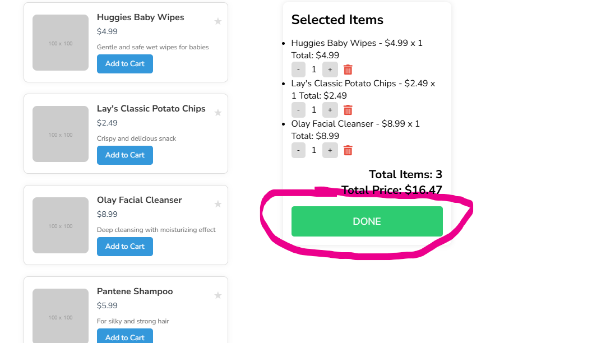

# **Smart Shopping Navigator App**

## **Overview**
The **Smart Shopping Navigator App** enhances the in-store shopping experience by making it safer, faster, and more efficient. With real-time data, intelligent navigation, and advanced algorithms, the app ensures a seamless shopping journey.

---

## **Features**

Displays real-time crowd levels for stores using visual indicators (*Low*, *Medium*, or *High*).  


### **Store Location with Map**
View nearby stores on a map, including crowd density and product availability.  

  

- **Pick Store And Confirm**  
  Users can select a store and confrim.


---

### **2. In-Store Experience**
- **Shopping List Management**  
  - Add, update, or delete items from the shopping list.  
  - See live updates for the total cost as you manage the list.  
  

- **Final Confirmation**  
  Allows users to review their shopping list before proceeding to checkout.

---
- **Smart Navigation**  
  - The app generates the most efficient route based on the store layout.  
  - Guides users to the nearest items on their list and provides estimated pickup times.  
  

- **Checklist for Progress Tracking**  
  - Users can check off items from their shopping list as they pick them up.  
  


---

### **3. Checkout Assistance**
- **Queue Monitoring**  
  Displays real-time data on checkout queue lengths to help users pick the shortest line.  
  


## **How It Works**

### **Step 1: Launch the App**
- The app displays a list of nearby stores, their crowd density, and their locations on a map.
- Users can click "Start Customizing List" to begin.

### **Step 2: Customize Your Shopping List**
- Use search and filter options to quickly find items and add them to the list.  
- Save frequently purchased items or lists under **Favorites** for future use.

### **Step 3: Navigate the Store**
- Upon entering the store, users receive a dynamic map with an optimized route to locate items efficiently.  
- Items can be checked off as users progress.

### **Step 4: Checkout**
- After completing their shopping, users are directed to the shortest checkout queue based on real-time data.

---

## **Live Vidoe Demo**

https://www.youtube.com/watch?v=9Qa8Krel6n0

---

## **Technology Stack**

- **Frontend**: HTML, CSS, JavaScript  
 


---

## **Installation and Usage**

1. **Clone the Repository**:
   ```bash
 [  git clone https://github.com/<your-repo-name>.git](https://github.com/SAMUR274/HCI_P-Roject.git)
 
